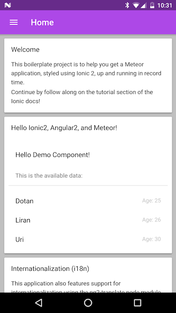

#Framework Versions
###Meteor 1.4.2.3
###Ionic2 rc4
###Angular 2.2.1

#Screenshots
###Android
   
###iOS
   

#References
This repository was created using the following resources. The base of this repo is a clone of [angular2-meteor-boilerplate](https://github.com/Urigo/angular2-meteor-base).
###[Urigo/Angular2-Meteor Boilerplate](https://github.com/Urigo/angular2-meteor-base)
###[driftyco/ionic2-starter-blank](https://github.com/driftyco/ionic2-starter-blank/tree/master/src/app)
###[driftyco/ionic2-app-base](https://github.com/driftyco/ionic2-app-base) 
###[ocombe/ng2-translate](https://github.com/ocombe/ng2-translate) && https://ionicframework.com/docs/v2/resources/ng2-translate/

###[Ionic2 changelog](https://github.com/driftyco/ionic/blob/master/CHANGELOG.md)
###Previous version of this repo [Ionic2-Meteor1.3-Starter](https://github.com/mjwheatley/Ionic2-Meteor1.3-Starter)

#Getting Started
```
git clone https://github.com/mjwheatley/ionic2-meteor-boilerplate.git

cd ionic2-meteor-boilerplate/app/

npm install

npm start
```

`npm install` will load all the dependencies for angular2-meteor, ionic2, and dev dependencies for building the application.


`npm start` will run the scripts in the package.json to build and start the application.

The scripts in package.json help build the application by using "node-sass" to include the ionic-angular and ionicons node modules when compiling the scss files, "copyfiles" to copy the needed fonts to the applications public directory, and "nodemon" to watch for changes in scss files and rebuild on the fly.  Finally they will execute meteor run, passing in a settings.json, to build and start the meteor application.

#Meteor Settings
This application is dependant on a settings.json file containing a key/value pair for the application name.
The line of code is in ngOnInit() of `app/client/imports/app/app.component.ts`.

```
// set the nav menu title to the application name from settings.json
this.appName = Meteor.settings.public.appName;
```

If you use `meteor run` to start the application you must also include `--settings ../config/development/settings.json` to get the application to run correctly.

#SASS
***Do not put SCSS files in the `app` directory***
##Put all SCSS files in the `theme` directory.  
***For ease of reference, you should mirror your `app/client/imports/app` folder tree.***

##Import all your project SCSS in `theme/app.core.scss`

###This project uses node-sass to compile SCSS files.
####Ionic2 SCSS files from the ionic-angular node module are added to the path for node-sass.
The `start` script will output platform specific css bundles into the `app/public/stylesheets/` directory and copy ionic fonts to `app/public/fonts/` .
The `app/client/index.html` file includes links to these stylesheets.
The method `setStyle()` in `app/client/imports/app/app.component.ts` will set only one of the stylesheets to be active based on the platform style class that Ionic adds to the `ion-app` tag.

#Mobile platforms
To run this application on a mobile device you will need to edit the package.json file.
Change the `meteor` script to the following:

```
"meteor": "meteor run ios-device --settings settings.json",
```

Then start the application the same as usual.

```
npm start
```

##Multi Language Support
This boilerplate comes with support for Internationalization using the ng2-translate node module.
* Add additional language files to `app/public/i18n/`.
* This boilerplate includes a custom component, ***LanguageSelectComponent*** (`app/client/imports/app/components/language-select/`), that you can edit to add support for additional languages.
    *  Add new languages to the alert dialog inputs:

```
inputs: [
                {type: 'radio', label: 'English', value: 'en', checked: (this.langCode === "en")},
                {type: 'radio', label: 'Español', value: 'es', checked: (this.langCode === "es")}
            ],
```

#Creating new pages/components
This boilerplate contains a ***template component*** that can be used to create a new page or component.
* Copy `app/client/imports/app/pages/newpage/` and rename the directory and files.
* Complete the TODOs listed in newpage.ts